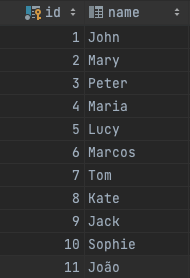

# FAMILY TREE API

# Como executar este projeto usando Docker Compose


Este projeto usa Docker Compose para criar um ambiente de execução para um projeto Python que está localizado na pasta cmd.

## Pré-requisitos
Antes de executar este projeto, certifique-se de ter o Docker e o Docker Compose instalados em seu sistema.

<a href=“https://www.docker.com/get-started/“>Docker</a>

<a href=“https://docs.docker.com/compose/install/“>Docker Compose</a>

## Instruções
- Clone este repositório em sua máquina local.
- Navegue até a pasta raiz do projeto.
- Abra um terminal ou prompt de comando na pasta raiz do projeto.
- Execute o seguinte comando para criar e iniciar os contêineres do Docker:
    ```CMD
    docker-compose up
    ```
- Aguarde até que o comando seja concluído. Isso pode levar alguns minutos, dependendo da velocidade da sua conexão com a internet.
- Para encerrar a execução do projeto, pressione Ctrl+C no terminal ou prompt de comando.
- Execute o seguinte comando para encerrar e remover os contêineres do Docker:
    ```
    docker-compose down
    ```
# Instruções para uso das APIs
Este documento descreve como usar as APIs disponibilizadas para o gerenciamento de informações de uma árvore genealógica.

# Executando o projeto

Para executar o projeto está na pasta raiz do projeto e navege até a pagina de `cmd`

execute o compandos 
- go build 
- go run main.go 

se preferir pode utilizar um arquivo launch.json para executar o codigo no VSCode
```JSON
{
    "version": "0.2.0",
    "configurations": [
        {
            "name": "Aplication LOCAL",
            "type": "go",
            "request": "launch",
            "mode": "auto",
            "program": "${workspaceFolder}/cmd",
            "env": {
            },
            "args": []
        },
    ]
}
```

## Endpoints
### 1. Consulta de histórico familiar
Para consultar o histórico familiar de uma pessoa, utilize o endpoint

```CURL
curl --location 'localhost:8080/family/history/{id}'
```

Substitua {id} pelo ID da pessoa que deseja consultar.

Retorno esperado:

```JSON
{
    "id": 10,
    "name": "Sophie",
    "members": [
        {
            "id": 5,
            "name": "Lucy",
            "relationship": "parents"
        },
        {
            "id": 6,
            "name": "Marcos",
            "relationship": "parents"
        },
        {
            "id": 1,
            "name": "John",
            "relationship": "grandparents"
        },
        {
            "id": 2,
            "name": "Mary",
            "relationship": "grandparents"
        }
    ]
}
```

### 2. Adicionar novo membro
Para adicionar um novo membro à árvore genealógica, utilize o endpoint:

```CURL
curl --location 'localhost:8080/family/member' \
--header 'Content-Type: application/json' \
--data '{
    "name": "Debora",
    "relationship": {
        "parent": {
            "parent1": 11
        },
        "children": [
            4,
            5,
            6
        ]
    }
}'

```
Substitua o conteúdo do campo data pelas informações do novo membro que deseja adicionar. Caso ocorra um erro, o retorno esperado é:

```JSON
{
    "message": "description"
}
```
Caso a operação seja bem sucedida, o retorno esperado é:

```JSON
{
    "Id": 12,
    "Name": "Debora",
    "ParentId1": 11,
    "ParentId2": null,
    "Generation": null
}
```


# Exemplo de árvore genealógica já inserida no banco de dados

Quando você iniciar o projeto ele vai inserir essa árvore automaticamente.

Esta é a árvore genealógica.


Estes são seus respectivos IDS.




